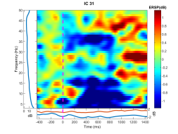
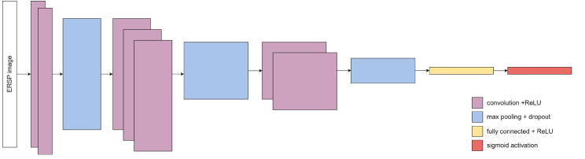
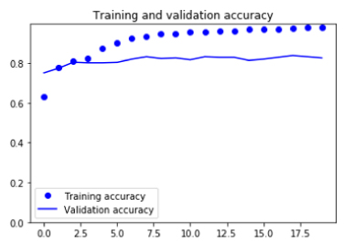
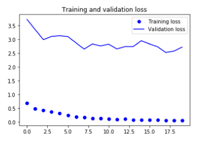
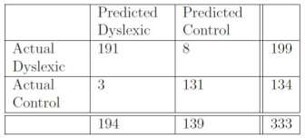

# fyp-deep-learning-eeg-public
My FYP on using Deep Learning to identify brain based medical conditions in children

**Disclaimer:** This repo is intended for public viewing only. As the data used in this project is private, you cannot run the notebook independently. Contact me if you need more info.

## Problem Statement

1. It is difficult to analyze large number of ERSP plots to make predictions out of it
2. If deep learning can be used to identify the children's brain disorders from the normal ones
3. Can high accuracy with minimal false predictions be achieved with deep learning

## Project Objectives

1. To design a deep learning framework to identify dyslexic from normal controls using EEG data
2. To implement the framework and test it on a data set
3. To evaluate the accuracy of the deep learning framework

## Project Scope

### Dataset

1. Event Related Spectral Perturbation (ERSP) images
2. 3228 total ERSP plots
3. 2662 training sets
4. 333 validation sets
5. 333 test sets

### Algorithm

1. Convolutional Neural Network (CNN)
2. Implemented using KERAS module, on top of Tensorflow

## Extraction of feature from EEG Dataset

### ERSP plots

An example of a _control_ ERSP plot

The X-axis is the time (ms) while the Y-axis is the frequency (Hz). The color indicates the intensity (dB)

## Deep Learning Model Architecture

Our model consist of 3 Conv2D layers with ReLU activation function, each followed with a Max Pooling with Dropout. The fully connected layer consist of 64 nodes with ReLU activation function, and at the end of the model is a sigmoid activation function with only 1 node.

## Results

### Graphs

  

    
  

  

    
  

Final validation accuracy is 0.8258 while for the training accuracy is 0.9782

### Confusion Matrix

We use 333 test sample in this confucion matrix
- Precision : 94.24
- Recall    : 97.76
- F-Measure : 95.97
- Accuracy  : 96.70

_If you have any enquiries feel free to contact me here_
